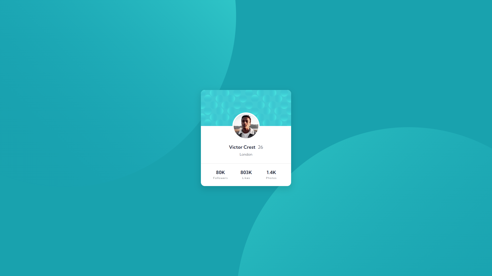

# Frontend Mentor - Profile card component solution

This is a solution to the [Profile card component challenge on Frontend Mentor](https://www.frontendmentor.io/challenges/profile-card-component-cfArpWshJ). Frontend Mentor challenges help you improve your coding skills by building realistic projects. 

## Table of contents

- [Overview](#overview)
  - [The challenge](#the-challenge)
  - [Screenshot](#screenshot)
  - [Links](#links)
- [My process](#my-process)
  - [Built with](#built-with)
  - [What I learned](#what-i-learned)
- [Author](#author)

## Overview

### The challenge

- Build out the project to the designs provided

### Screenshot

### Links

- [Solution URL](https://www.frontendmentor.io/solutions/flexbox-profile-card-component-SulrXy2_it)
- [Live site URL](http://kapline.me/profile-card-component-main/)

## My process

### Built with

- Semantic HTML5 markup
- CSS custom properties
- Flexbox
- GitHub Pages

### What I learned

This challenge was the first time I have ever used a `position: absolute` property. Not sure if it was the best way to position the avatar, but at least it looks right.

## Author

- Frontend Mentor - [@TrueKapline](https://www.frontendmentor.io/profile/TrueKapline)